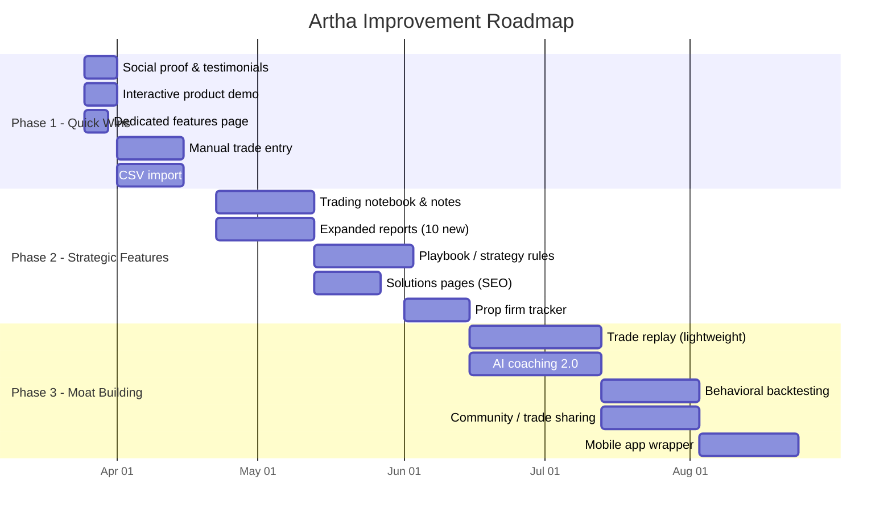

# Artha vs. TradeZella: Competitive Analysis & Improvement Plan

This document provides a detailed feature-by-feature comparison between
[Artha](https://arthatrades.com) and [TradeZella](https://tradezella.com),
identifies gaps, and outlines a prioritized improvement plan to close
those gaps while doubling down on Artha's unique strengths.

> [!IMPORTANT]
> Artha's core differentiator — **behavioral cost transparency** — is
> something TradeZella doesn't have. The goal isn't to clone TradeZella.
> It's to close critical feature gaps while deepening the behavioral edge
> that makes Artha unique.

---

## Side-by-side feature comparison

| Feature Area | TradeZella | Artha | Gap? |
|:---|:---|:---|:---|
| **Auto-sync trades** | 500+ brokers (file upload, manual, API sync) | 100+ brokers via SnapTrade (auto API sync) | ⚠️ Broker count, CSV upload missing |
| **Manual trade entry** | Yes (manual add, file upload) | No | 🔴 Missing |
| **FIFO P&L engine** | Basic P&L tracking | ✅ Built-in FIFO engine | ✅ Artha ahead |
| **R-Multiple analytics** | Basic R-multiple stat | ✅ Net R, Avg R, risk coverage, per-setup R | ✅ Artha ahead |
| **Behavioral Alpha** | Not offered | ✅ Dollar-cost of FOMO, revenge trades, rule breaks | ✅ Artha unique |
| **Psychology/emotion tags** | Tags exist but not dollarized | ✅ Custom psychology tags tied to P&L | ✅ Artha ahead |
| **Setup performance** | Playbooks with rule tracking | ✅ Setup analytics with P&L per setup | 🟡 Parity |
| **AI coaching insights** | Not offered | ✅ Weekly behavioral reports | ✅ Artha ahead |
| **Trade replay** | ✅ Tick-by-tick replay with chart, L2, T&S | Not offered | 🔴 Missing |
| **Backtesting** | ✅ 11+ years historical data, multi-asset | Not offered | 🔴 Missing |
| **Playbooks (strategy rules)** | ✅ Set rules, track violations, rate trades | Basic tag-based setup tracking | ⚠️ Partial |
| **Notebook/notes** | ✅ Custom templates, trading plans, recaps | Not offered | 🔴 Missing |
| **Calendar heatmap** | ✅ Built-in calendar view | ✅ Calendar view exists | 🟡 Parity |
| **50+ drilled-down reports** | ✅ Day-of-week, time, setup, emotion, etc. | Limited reports page | ⚠️ Fewer reports |
| **Equity curve / profitability charts** | ✅ Multiple chart types | ✅ Reports charts exist | 🟡 Parity |
| **Share/export** | Share trades, export data | ✅ Share report, CSV export | 🟡 Parity |
| **Community features** | ✅ Discord, webinars, trade sharing | Not offered | 🔴 Missing |
| **Education (Zella University)** | ✅ Bootcamps, webinars, resources | Blog/Learn section with articles | ⚠️ Less structured |
| **Mentor mode** | ✅ Coaches see student analytics | Not offered | 🔴 Missing |
| **Prop firm tracking** | ✅ Drawdown, daily loss limits, challenge metrics | Not offered | 🔴 Missing |
| **Mobile app** | Web only | Web only | 🟡 Same |
| **Social proof on site** | 800+ reviews, 4.8 stars, 100K+ users, influencer logos | 23 grandfathered users, no reviews | 🔴 Weak |
| **Pricing** | $29/mo Basic, $49/mo Pro | $12/mo Pro, $99 lifetime | ✅ Artha ahead |
| **Free tier** | No free tier | 30-day free trial + grandfather clause | ✅ Artha ahead |

---

## Visual & UX comparison

````carousel

<!-- slide -->

<!-- slide -->

<!-- slide -->

````

### TradeZella strengths (design)
- **Interactive product demos** on the landing page (tab switcher for
  Analytics, Notebook, Reporting, Journal, Backtesting, Replay, Playbook)
- **Massive social proof**: 800+ reviews, 4.8 stars, 100K+ traders,
  influencer endorsements, TrustPilot badge
- **Feature chips**: Pill-shaped labels that make feature lists scannable
- **Breadth of content pages**: Dedicated pages for features, solutions
  (by trader type), backtesting, broker support, blog, careers, partners

### Artha strengths (design)
- **Premium dark aesthetic**: The glassmorphism, forest-green palette,
  and serif headings feel noticeably more premium than TradeZella's
  standard SaaS look
- **Behavioral Alpha cards**: The dollarized mistake cost visualization
  is unique and immediately compelling
- **Week 1 vs. Week 8**: Effective before/after framing
- **Founder story**: "Built by a trader who got tired of guessing" adds
  authenticity

### Artha weaknesses (design)
- **No interactive product demos**: Users can't see the dashboard before
  signing up
- **Sparse social proof**: Only "23 users grandfathered" shown, no
  reviews or testimonials
- **No dedicated features page**: Everything is on one long landing page
- **No solutions segmentation**: TradeZella targets 5 trader types with
  dedicated pages
- **Limited blog content**: Only 3 articles visible

---

## Prioritized improvement plan

The improvements are organized into three phases based on impact and
effort. Each item links directly to a competitive gap identified above.

### Phase 1: High-impact, low-effort (weeks 1–4)

These are changes that close perception gaps without requiring major
backend work.

#### 1.1 Add social proof & testimonials

| Detail | Value |
|:---|:---|
| **Gap closed** | Social proof deficit |
| **What to build** | Testimonial carousel with real trader quotes, star ratings, and "X traders using Artha" counter |
| **Effort** | Low (frontend only) |
| **How** | Reach out to existing grandfathered users for quotes. Add a rotating testimonial component to the landing page hero area. Display a live user counter. |
| **Files affected** | `src/app/page.tsx`, new `src/components/landing/testimonials.tsx` |

#### 1.2 Add manual trade entry

| Detail | Value |
|:---|:---|
| **Gap closed** | Users without supported brokers can't use Artha |
| **What to build** | Manual trade addition form (symbol, date, side, quantity, price, fees) |
| **Effort** | Medium (API + form UI) |
| **How** | Add a "Manual Entry" tab alongside broker sync in the journal page. Create `POST /api/trades/manual` endpoint that creates trade records directly. |
| **Files affected** | New `src/components/manual-trade-form.tsx`, `src/app/api/trades/manual/route.ts`, `src/app/(dashboard)/journal/page.tsx` |

#### 1.3 Add CSV/file upload import

| Detail | Value |
|:---|:---|
| **Gap closed** | TradeZella supports 500+ brokers partly through file upload |
| **What to build** | CSV upload with column mapper for common broker export formats |
| **Effort** | Medium (parser + mapping UI) |
| **How** | Support common CSV formats (thinkorswim, Webull, IBKR). Auto-detect column types. Preview before import. |
| **Files affected** | New `src/components/csv-import.tsx`, `src/app/api/trades/import/route.ts` |

#### 1.4 Interactive product demo on landing page

| Detail | Value |
|:---|:---|
| **Gap closed** | Users can't see the product before signing up |
| **What to build** | Interactive tab switcher showing dashboard screenshots/mockups (similar to TradeZella's homepage tabs) |
| **Effort** | Low (frontend only) |
| **How** | Create a tabbed component with pre-rendered screenshots of: Dashboard, Journal, Behavioral Alpha, Setup Analytics, Calendar |
| **Files affected** | New `src/components/landing/product-demo-tabs.tsx`, `src/app/page.tsx` |

#### 1.5 Dedicated features page

| Detail | Value |
|:---|:---|
| **Gap closed** | No standalone features page for SEO + detailed exploration |
| **What to build** | `/features` page with structured sections: Journaling, Analytics, Behavioral Alpha, R-Multiples, AI Coaching |
| **Effort** | Low (new page, content from existing copy) |
| **How** | Break out the feature sections from `page.tsx` into a dedicated features page with deeper descriptions and product screenshots |
| **Files affected** | New `src/app/features/page.tsx` |

---

### Phase 2: Strategic feature additions (weeks 5–12)

These address functional gaps that TradeZella has and Artha doesn't.

#### 2.1 Trading notebook / journal notes

| Detail | Value |
|:---|:---|
| **Gap closed** | No notebook/notes functionality |
| **What to build** | Per-trade and per-day notes with rich text, custom templates, and pre-trade/post-trade structure |
| **Effort** | Medium-High |
| **How** | Add a `Note` model to Prisma schema linked to positions. Build a rich-text editor (tiptap) in the trade detail sheet. Support pre-trade plan and post-trade recap fields. |
| **Schema changes** | New `Note` model: `id, userId, positionKey, preTradeNote, postTradeNote, createdAt, updatedAt` |
| **Files affected** | `prisma/schema.prisma`, new `src/app/api/notes/route.ts`, updated `src/components/trade-detail-sheet.tsx` |

#### 2.2 Playbook / strategy rules engine

| Detail | Value |
|:---|:---|
| **Gap closed** | TradeZella's Playbooks let traders define rules and track violations |
| **What to build** | Strategy playbooks where traders define entry/exit rules, then measure compliance per trade |
| **Effort** | High |
| **How** | Create a `Playbook` model with rules (checklist items). When reviewing a trade, the trader checks which rules they followed/broke. Aggregate compliance stats per playbook. |
| **Schema changes** | `Playbook` model with `PlaybookRule[]` children, `TradePlaybookCheck` join table |
| **Files affected** | `prisma/schema.prisma`, new `src/app/(dashboard)/playbooks/`, new API routes |

#### 2.3 Expanded reports suite (50+ style)

| Detail | Value |
|:---|:---|
| **Gap closed** | TradeZella advertises 50+ reports |
| **What to build** | Additional drilled-down reports: P&L by day of week, by hour, by holding duration, by symbol sector, by trade size, streak analysis, drawdown analysis |
| **Effort** | Medium |
| **How** | Extend the existing `src/components/reports-charts.tsx` with new chart types. Add filter dimensions to the `src/app/api/metrics/route.ts` endpoint. |
| **Specific reports to add** | 1. P&L by day of week 2. P&L by hour of day 3. P&L by holding duration 4. Win/loss streaks 5. Max drawdown chart 6. P&L by position size bucket 7. Setup win rate over time 8. R-multiple distribution histogram 9. Emotion impact over time 10. Consistency score trend |
| **Files affected** | `src/components/reports-charts.tsx`, `src/app/api/metrics/route.ts`, `src/app/(dashboard)/reports/page.tsx` |

#### 2.4 Solutions pages (by trader persona)

| Detail | Value |
|:---|:---|
| **Gap closed** | TradeZella has 5 dedicated solution pages by trader type |
| **What to build** | Landing pages for: "New Traders," "Options Traders," "Day Traders," "Swing Traders" |
| **Effort** | Low-Medium (content + SEO pages) |
| **How** | Create persona-targeted pages under `src/app/solutions/` explaining how Artha specifically helps each type. This is also a major SEO play. |
| **Files affected** | New `src/app/solutions/[persona]/page.tsx` |

#### 2.5 Prop firm dashboard & tracking

| Detail | Value |
|:---|:---|
| **Gap closed** | TradeZella targets prop firm traders with drawdown/daily-loss tracking |
| **What to build** | Prop firm challenge mode: set max drawdown, daily loss limit, profit target. Track progress against rules in real time. |
| **Effort** | Medium |
| **How** | Add a "Challenge" configuration model. Dashboard widget showing daily P&L vs. allowed daily loss, trailing drawdown vs. allowed max drawdown, and days remaining. |
| **Schema changes** | New `PropFirmChallenge` model: `maxDrawdown, dailyLossLimit, profitTarget, startDate, endDate, status` |
| **Files affected** | `prisma/schema.prisma`, new `src/components/dashboard/prop-firm-tracker.tsx`, new API routes |

---

### Phase 3: Differentiation & moat (weeks 13–24)

These are bigger bets that deepen Artha's unique moat and create features
TradeZella doesn't have.

#### 3.1 Trade replay (selective implementation)

| Detail | Value |
|:---|:---|
| **Gap closed** | TradeZella's signature feature |
| **What to build** | Simplified trade replay using TradingView widget with entry/exit markers overlaid on historical charts |
| **Effort** | High |
| **How** | Use TradingView's Lightweight Charts library to render candle data for the trade's time window. Overlay entry/exit arrows and P&L zones. This is significantly lighter than TradeZella's full L2/T&S replay but still valuable. |
| **Key decision** | Full tick-by-tick replay requires expensive data feeds. Start with daily/hourly candle replay with execution markers. |
| **Files affected** | New `src/components/trade-replay.tsx`, data feed integration |

#### 3.2 AI coaching 2.0 — conversational AI

| Detail | Value |
|:---|:---|
| **Gap closed** | Deepens Artha's AI advantage beyond what TradeZella has |
| **What to build** | Conversational AI that answers questions about your trading data: "What's my worst day of the week?" "Show me my FOMO trades last month." |
| **Effort** | High |
| **How** | Use Gemini API with structured function calling. The AI has access to the user's aggregated metrics and can query the database to answer natural-language questions about their performance. |
| **Files affected** | New `src/app/api/ai-chat/route.ts`, new `src/components/ai-chat.tsx` |

#### 3.3 Behavioral backtesting

| Detail | Value |
|:---|:---|
| **Gap closed** | Creates a new category beyond TradeZella's price-action backtesting |
| **What to build** | "What if" simulator: Remove all trades tagged with a specific emotion or mistake and show the hypothetical equity curve / P&L |
| **Effort** | Medium |
| **How** | Filter the user's existing trade history by excluding specific tags (FOMO, revenge, etc.) and recalculate the equity curve. Display side-by-side: actual vs. "disciplined" equity curve. |
| **Why this matters** | TradeZella backtests price strategies. Artha backtests behavioral patterns. This is a category-defining feature. |
| **Files affected** | New `src/components/behavioral-backtest.tsx`, extend `src/app/api/metrics/route.ts` |

#### 3.4 Community / trade sharing (lightweight)

| Detail | Value |
|:---|:---|
| **Gap closed** | TradeZella has community features |
| **What to build** | Optional public profile + shareable trade setups (not a full community platform) |
| **Effort** | Medium |
| **How** | Extend the existing `share-report.tsx` to support sharing individual setup analyses. Add an optional public profile at `/u/[username]` showing aggregate stats. |
| **Files affected** | Updated `src/components/share-report.tsx`, new `src/app/u/[username]/page.tsx` |

#### 3.5 Mobile app wrapper

| Detail | Value |
|:---|:---|
| **Gap closed** | Neither platform has a native mobile app |
| **What to build** | PWA + optional Capacitor wrapper for App Store/Google Play presence |
| **Effort** | Medium |
| **How** | The Next.js app is already responsive. Add PWA manifest, service worker, and offline caching. Optionally wrap with Capacitor for app store distribution. |
| **First-mover opportunity** | TradeZella is web-only. Shipping a mobile app first is a major competitive advantage. |

---

## Blog & content strategy improvements

TradeZella has a substantial blog and "Zella University." Artha currently
has 3 articles under `/learn`. Here's how to close the content gap:

### Quick wins (publish within 2 weeks)
1. **"Artha vs. TradeZella: Which Trading Journal Is Right for You?"** —
   Direct comparison page targeting search intent
2. **"What Are R-Multiples and Why They Matter"** — Educational content
   that promotes Artha's built-in R-multiple tracking
3. **"How to Stop Revenge Trading: A Data-Driven Approach"** — ties
   directly to Behavioral Alpha
4. **"Trading Journal Setup Guide: 5-Minute Artha Walkthrough"** — Step
   by step onboarding content with screenshots
5. **"The Psychology of Losing Streaks"** — Emotional trading content
   that targets psychology-focused traders

### Ongoing cadence
- Publish **2 articles per week** targeting long-tail keywords
- Focus areas: trading psychology, risk management, setup analysis,
  journal best practices
- Each article includes a CTA linking to the relevant Artha feature

---

## Website architecture improvements

### Pages to create

| Page | Purpose | SEO Impact |
|:---|:---|:---|
| `/features` | Dedicated features page | High |
| `/solutions/day-traders` | Persona targeting | High |
| `/solutions/options-traders` | Persona targeting | High |
| `/solutions/prop-firm-traders` | Persona targeting | High |
| `/solutions/swing-traders` | Persona targeting | Medium |
| `/compare/tradezella` | Direct comparison page | Very High |
| `/compare/tradersync` | Direct comparison page | High |
| `/brokers` | Supported brokers list with logos | Medium |
| `/changelog` | Build-in-public credibility | Low |

### Navigation updates

Current navigation: `Product | How It Works | Pricing | Blog/Learn |
Log in | Connect Free`

Proposed navigation:
```
Features ▼              Solutions ▼           Pricing    Learn ▼        Log in   [Get Started Free]
├── Dashboard           ├── Day Traders       (link)     ├── Blog
├── Behavioral Alpha    ├── Options Traders              ├── Guides
├── R-Multiples         ├── Prop Firm                    ├── Compare
├── AI Coaching         ├── Swing Traders
├── Setup Analytics
```

---

## Priority execution summary



---

## Key strategic takeaways

> [!TIP]
> **Don't try to out-TradeZella TradeZella.** They have a 3+ year head
> start on breadth. Instead, go deeper on behavioral analytics — that's
> your moat. Close the obvious table-stakes gaps (manual entry, CSV,
> notes, reports) and then invest in features that only Artha can
> credibly build.

### Where Artha wins today
- **Price**: $12/mo vs. $29–49/mo — massive advantage
- **Behavioral Alpha**: Dollar-cost of trading mistakes is unique
- **R-Multiple depth**: More sophisticated than TradeZella's basic stat
- **AI coaching**: Weekly behavioral reports don't exist elsewhere
- **Design quality**: Premium dark aesthetic vs. generic SaaS look

### Where TradeZella wins today
- **Feature breadth**: Backtesting, replay, notebooks, playbooks
- **Social proof**: 100K+ users, 800+ reviews, influencer partnerships
- **Content depth**: University, bootcamps, blog volume
- **Broker support**: 500+ vs. 100+ (largely through file upload)
- **Persona targeting**: 5 dedicated solution pages

### The play
1. **Phase 1**: Close the "table stakes" gaps (manual entry, CSV, social
   proof, features page) so prospects don't dismiss Artha during
   evaluation
2. **Phase 2**: Add strategic features (notes, playbooks, reports) that
   make Artha competitive for users considering a switch
3. **Phase 3**: Build moat features (behavioral backtesting, AI chat,
   trade replay) that create a category Artha owns

The pricing advantage means Artha only needs **feature parity on the
basics** to win price-sensitive switchers. The behavioral analytics moat
means Artha can win psychology-focused traders even at the same price.
